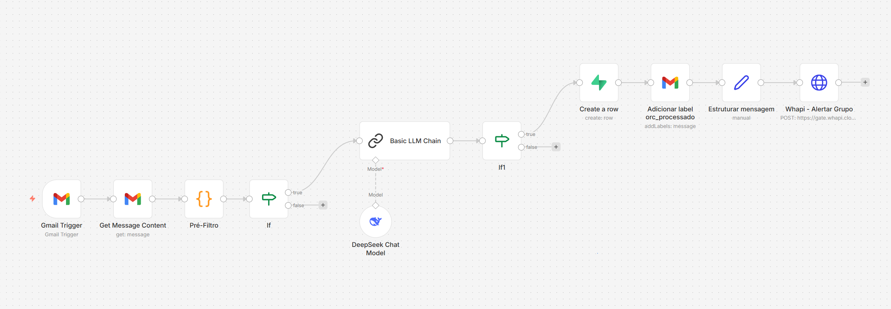

# Automação de triagem de pedidos de orçamento por e-mail

Case técnico de uma automação real em n8n para triagem comercial de pedidos de orçamento recebidos por e-mail.

O projeto documenta a arquitetura, o fluxo de dados, as integrações e o processo de sanitização necessário para transformar uma automação operacional em um repositório público de portfólio, sem expor credenciais, dados de clientes ou artefatos de produção.

## Resumo Executivo

A automação monitora uma caixa comercial, identifica mensagens candidatas a novo pedido de orçamento, limpa o conteúdo do e-mail, classifica, extrai e estrutura os dados com apoio de LLM, registra os dados em uma base operacional e envia um alerta para acompanhamento comercial.

O foco do repositório não é apenas armazenar um workflow exportado. A proposta é mostrar como uma solução real foi organizada para leitura pública: com documentação técnica, workflow sanitizado, amostras fictícias baseadas na estrutura real dos outputs e evidências visuais do fluxo.

## Competências demonstradas

Este projeto demonstra experiência prática em:

- Automação orientada a eventos
- Processamento e normalização de dados não estruturados
- Aplicação de LLM em cenário operacional real
- Engenharia de prompts para classificação e extração estruturada
- Redução de custo computacional com pré-processamento determinístico
- Transformação de texto livre em payload estruturado
- Persistência e rastreabilidade operacional
- Integração entre serviços utilizando APIs e webhooks
- Desenvolvimento de lógica aplicada utilizando JavaScript
- Conversão de processos comerciais em soluções automatizadas

## Problema Resolvido

Pedidos de orçamento chegam por e-mail junto com respostas, avisos, encaminhamentos e mensagens administrativas. Sem triagem estruturada, a equipe comercial precisa ler manualmente cada mensagem, identificar se há uma solicitação válida e registrar os dados relevantes para acompanhamento.

Esta automação reduz esse trabalho repetitivo ao separar candidatos a novo orçamento, extrair informações operacionais e acionar o time responsável quando o pedido é confirmado.

## Estratégia Arquitetural

O workflow combina regras determinísticas e classificação semântica:

1. O Gmail monitora mensagens não lidas na caixa comercial.
2. O conteúdo completo do e-mail é recuperado.
3. Um Code node limpa HTML/texto, remove histórico de threads e aplica um pré-filtro.
4. Um IF evita acionar o LLM quando a mensagem não parece candidata.
5. O LLM classifica o e-mail e retorna um JSON estruturado.
6. Um segundo IF confirma se o resultado é `NOVO_ORCAMENTO`.
7. O Supabase registra os dados estruturados.
8. O Gmail aplica uma label de processamento.
9. Uma mensagem operacional é montada e enviada via gateway de WhatsApp.

## Decisões técnicas relevantes

Durante o desenvolvimento foram adotadas decisões para reduzir processamento desnecessário e aumentar previsibilidade do fluxo.

### Pré-processamento antes da LLM

O workflow executa limpeza do conteúdo do e-mail antes da inferência:

- remoção de HTML
- remoção de histórico de threads
- remoção de encaminhamentos
- normalização do assunto

Após o pré-processamento, regras determinísticas validam se o e-mail possui características mínimas de um pedido de orçamento.

Somente mensagens candidatas seguem para classificação com LLM.

### Classificação estruturada

O modelo não retorna texto livre.

A saída é convertida para JSON estruturado contendo:

- classificação do e-mail
- identificação do contato
- empresa
- data e horário normalizados
- resumo operacional

### Persistência e rastreabilidade

Somente pedidos classificados como novos orçamentos são registrados e distribuídos operacionalmente.

## Captura do Workflow



A captura mostra somente a topologia do workflow no canvas do n8n. Painéis de configuração, payloads, credenciais, tokens e dados reais foram mantidos fora da documentação pública.

## Stack

- **n8n** — orquestração e execução do workflow
- **Gmail** — captura e gerenciamento das mensagens
- **JavaScript** — pré-processamento textual e regras operacionais
- **DeepSeek (LLM)** — classificação semântica e extração estruturada
- **Supabase** — persistência operacional
- **HTTP APIs** — distribuição e comunicação entre serviços
- **WhatsApp Gateway (Whapi)** — envio operacional dos alertas

## Fluxo macro

1. Monitoramento da caixa comercial
2. Recuperação do conteúdo completo do e-mail
3. Limpeza e normalização textual
4. Pré-filtragem determinística
5. Classificação e extração com LLM
6. Validação do resultado
7. Registro operacional
8. Marcação do e-mail
9. Distribuição do alerta

## Estrutura do Repositório

```text
.
├── README.md
├── .gitignore
├── assets/
│   └── screenshots/
├── docs/
├── samples/
└── workflows/
    └── sanitizados/
```

## Como Navegar

- [docs/01-visao-geral.md](docs/01-visao-geral.md): visão funcional da automação.
- [docs/02-arquitetura.md](docs/02-arquitetura.md): componentes, responsabilidades e fluxo de dados.
- [docs/03-privacidade.md](docs/03-privacidade.md): critérios de sanitização e segurança.
- [docs/04-checklist-publicacao.md](docs/04-checklist-publicacao.md): checklist final antes da publicação.
- [docs/05-workflow-orcamentos-email-comercial.md](docs/05-workflow-orcamentos-email-comercial.md): documentação individual do workflow.
- [docs/06-roadmap-evolucao.md](docs/06-roadmap-evolucao.md): roadmap de evolução da automação já ativa em produção.
- [samples/README.md](samples/README.md): exemplos públicos fictícios baseados na estrutura dos outputs reais.
- [workflows/sanitizados/01-orcamentos-email-comercial.sanitizado.json](workflows/sanitizados/01-orcamentos-email-comercial.sanitizado.json): export público sanitizado do workflow.

## Amostras Públicas

Os arquivos em `samples/` representam estados importantes do fluxo:

- e-mail recuperado pelo Gmail;
- saída do pré-filtro;
- classificação estruturada pelo LLM;
- registro preparado para o Supabase;
- label aplicada no Gmail;
- mensagem preparada e retorno sanitizado do envio via Whapi.

Todas as amostras usam dados fictícios ou placeholders.

## Privacidade

O export original continha credenciais, IDs internos, webhooks, token de API, dados de configuração da instância, dados operacionais e `pinData`. Esses artefatos foram removidos do projeto.

Apenas a versão sanitizada do workflow deve ser publicada. Exports originais, outputs reais, payloads brutos e prints de configuração interna não fazem parte deste repositório.

## Evolução

O fluxo documentado já representa uma automação ativa em produção. O roadmap em [docs/06-roadmap-evolucao.md](docs/06-roadmap-evolucao.md) registra melhorias planejadas para ampliar robustez, observabilidade e capacidade de processamento, sem tratar essas melhorias como requisitos para funcionamento atual.

## Estado do Projeto

Automação real em produção, documentada e sanitizada para fins de portfólio técnico.
