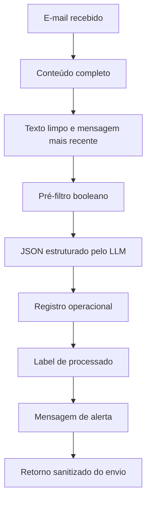

# Arquitetura

## Componentes

| Componente | Responsabilidade |
| --- | --- |
| Gmail Trigger | Monitorar mensagens não lidas da caixa comercial. |
| Gmail | Buscar o conteúdo completo da mensagem recebida. |
| Code node | Converter HTML em texto, remover histórico e aplicar pré-filtro. |
| IF | Encaminhar apenas candidatos a pedido de orçamento para o LLM. |
| LLM Chain | Classificar a mensagem e extrair campos estruturados. |
| IF1 | Confirmar se a classificação final é novo orçamento. |
| Supabase | Registrar os dados estruturados do pedido. |
| Gmail label | Marcar o e-mail como processado. |
| Set | Montar a mensagem operacional. |
| HTTP Request | Enviar alerta para o canal de WhatsApp. |

## Fluxo de Dados

## Decisões Técnicas

- O pré-filtro reduz custo e ruído antes da classificação por LLM.
- O Code node remove trechos antigos de threads, respostas e encaminhamentos para evitar classificação baseada em histórico.
- O prompt do LLM exige resposta somente em JSON, facilitando persistência e validação.
- A persistência acontece antes do alerta operacional, garantindo rastreabilidade.
- A label no Gmail evita reprocessamento do mesmo e-mail.
- O canal de WhatsApp é tratado como saída operacional, não como fonte de verdade.

## Dados Estruturados

O registro persistido inclui, entre outros campos:

- timestamp de processamento;
- identificadores da mensagem e thread;
- remetente bruto sanitizado nos exemplos públicos;
- nome do contato;
- empresa;
- assunto;
- resumo;
- data e hora recebidas;
- tipo classificado;
- status de resposta.
